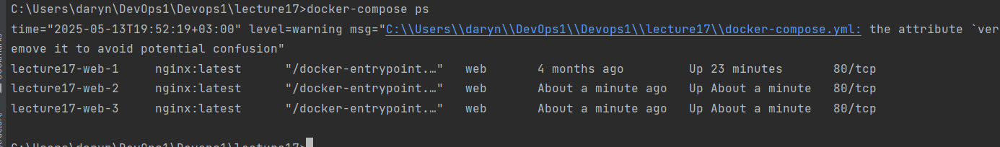

1. Завантажила Docker на Windows
2. Створила docker-compose.yml
3.
docker-compose up -d

docker-compose ps

4. Налаштування мережі й томів
   docker network ls
   docker volume ls

5. Масштабування сервісів
Секцію ports видаляємо з web, оскільки Docker не може призначити різні порти
для одного сервісу при масштабуванні автоматично.

docker-compose ps
